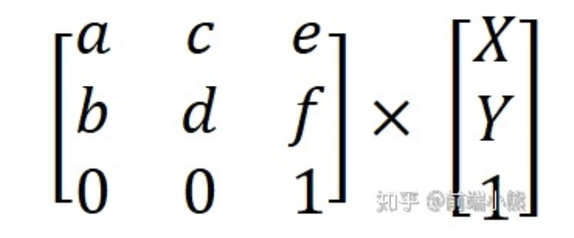

# `canvas-transform`

### transform matrix

transform: `ctx.transform(a: number, b: number, c: number, d: number, e: number, f: number):`

$$
  \begin{matrix}
   a & c & e \\
   b & d & f \\
   0 & 0 & 1
  \end{matrix}
$$

平移: `translate(x: number, y: number)`

$$
  \begin{matrix}
   1 & 0 & x \\
   0 & 1 & y \\
   0 & 0 & 1
  \end{matrix}
$$

缩放: `scale(x: number, y: number)`

$$
  \begin{matrix}
   x & 0 & 0 \\
   0 & y & 0 \\
   0 & 0 & 1
  \end{matrix}
$$

旋转: `rotate(α: number);`

$$
  \begin{matrix}
   \cos α & -\sin α & 0 \\
   \sin α & \cos α & 0 \\
   0 & 0 & 1
  \end{matrix}
$$

斜切: `skew(x, y)`

$$
  \begin{matrix}
   1 & \tan α & 0 \\
   -\tan α & 1 & 0 \\
   0 & 0 & 1
  \end{matrix}
$$

### 大小的变化

- origin.x/y
- width/height

左上 0: x y -
左中 1
左下 2

中上 3
中下 5

右上 6
右中 7
右下 8

### QA

1. 变化会导致缩放出问题
2. 测试 origin/clip/文本
3. path 有必要有 origin 属性么
4. 调整 rotate 到 shared
